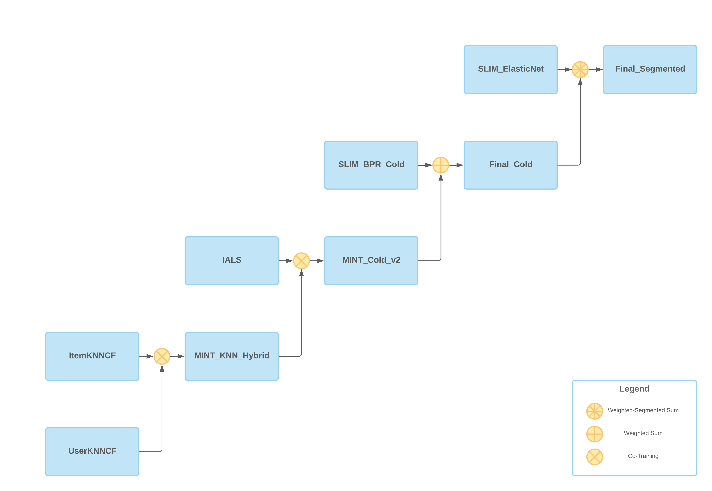

# RECOMMENDER SYSTEM 2021 CHALLENGE

This repository contains the code used for the [Recommender System 2021 Challenge](https://www.kaggle.com/c/recommender-system-2021-challenge-polimi) hosted by the Recommender Systems course at [Politecnico di Milano](https://www.polimi.it/).
The repository is split in 2 main folders:
* [Challenge2021](https://github.com/Menta99/RecSys2021_Mainetti_Menta/tree/main/Challenge2021) which contains our custom models and scripts created for the competition
* [RecSysCourseMaterial](https://github.com/Menta99/RecSys2021_Mainetti_Menta/tree/main/RecSysCourseMaterial) which contains the codebase given by the professor

## Overview

The complete description of the problem can be found in the [kaggle competition page](https://www.kaggle.com/c/recommender-system-2021-challenge-polimi/overview). 

Briefly, given the **User Rating Matrix** and some **Item Content Matrices**, the objective of the competition was to create a recommender for **TV series/Movies**.

The evaluation metric used was the **MAP@10**.

After a preprocessing phase, we used the following dataset:

* **URM**, 
  * **13650** users
  * **18059** items
  * **2.14%** data sparsity
* **ICM**
  * **18059** items 
  * **335** attributes
  * **1.29%** data sparsity

## Strategy
We approached the problem through different stages:
* At first, we performed some **data exploration**, in order to find interesting patterns in the dataset, 
we discovered in fact the following singularities:
  * Some episodes belong to more than one TV series/Movie
  * Some TV series/Movie even if without channel have been seen by some users
  * Some TV series/Movie even if without episodes have been seen by some users
* Then we **profiled** the base models to find the best performers, both in general and in the different 
user segments (**cold**, **warm** and **hot**).
* The next phase was focused on building **hybrids**, mainly composed by **2 models** at time in order 
to better control their optimization

## Best Model

The **ICMs** were not so effective in our experiments, thus we decided to focus on the information contained in the **URM**.
Our best model was in fact a **Collaborative Stratified Hybrid**, composed by different models aggregated at distinct stages.

In particular the final structure was the following:

	

